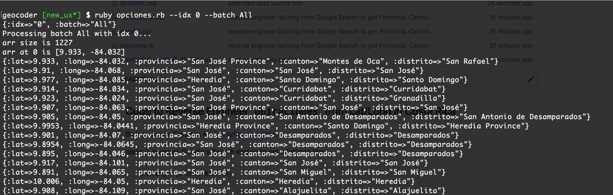

## Code to Reverse Engineer `Ubicaciones` from Lat/Long in Costa Rica
By Ing. Jimmy Figueroa A - jimmyfigueroa@me.com 

Ideas is leverage Google's Search engine to get a lat/long like: 

      lat/long = [6.5917,-82.4448]

and turn it into:

      provincia, cantón, distrito = San José, Curridabat, Granadilla

You may choose your own language to do it, I found it easier
to get the job done with Ruby on Rails by leveraging the Geocoder Gem,
which is in fact an easier interface for Google's Search Engine.

## Data Source
Ovsicori-UNA from Costa Rica 

      http://www.ovsicori.una.ac.cr/index.php/sismologia/sistemas-consulta/sismicidad-anual

Data file manually scrapped by the Author from the above link:

      sismisidad-cr-2009-2018ytd.xlsx

Data file contains earthquake events recorded by OVSICORI-UNA ever since 2009 to the latest events in 2018 year to date.

## Pre-requisites 
Basic knowledge of Ruby on Rails programming and have Ruby on Rails set up in your environment.

## Instructions for Ruby on Rails

* create a new ruby on rails app (i.e: costa_rica_geocoder) 
* download/clone this repo into your local Mac/PC/Laptop
* for the purpose of this code, the lat/log of file:

      sismisidad-cr-2009-2018ytd.xlsx

  has been refactored into an array of lat/long as part of the Ruby code like this:

      arr = [ [lat1, long1], [lat2, long2], ... ]

* install Geocoder Gem from your command line like this:

      gem install Geocoder
      bundler install 

* edit your Gemfile and add Geocoder to it like this:

      gem 'Geocoder'

* at this point you should be able to run the Ruby Script file from the command line like this:

      # --idx = 0 means process all from the top lat/long
      # -- batch = All means give my output file a name like `dataAll`
      ruby opciones.rb --idx 0 --batch All

  running output should look like this:

  

* open `dataAll.csv` with your editor of choice and save the file with:

      Encoding UTF-16 

  the above is to guarantee spanish characters are recognized

* at this point you may freely open `dataAll.csv` with Excel and copy/paste into the original file `sismisidad-cr-2009-2018ytd.xlsx` in order to match lat/long with provincias, cantones and distritos.

* enjoy!
      
